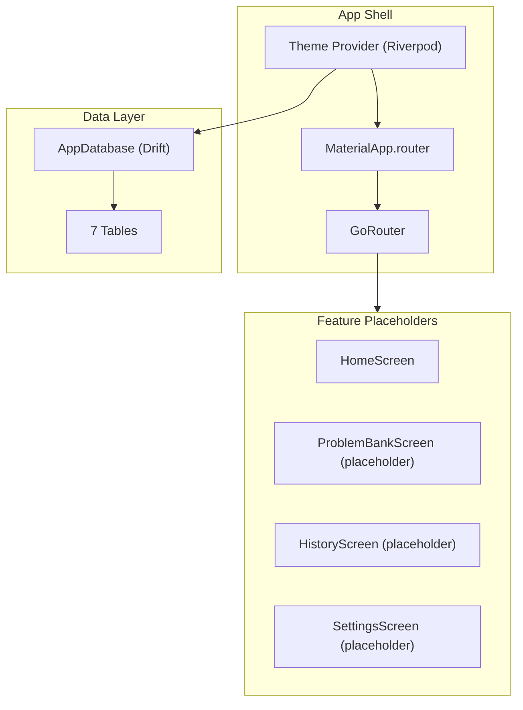

# Spec 01: App Foundation — plan.md

## Architecture Overview

## Technology Stack and Key Decisions

| Decision | Choice | Rationale |
|----------|--------|-----------|
| State Management | Riverpod (flutter_riverpod) | Industry standard; StateNotifier pattern for structured state |
| Navigation | go_router | Declarative, deep linking, shell routes for interview layout |
| Persistence | Drift (SQLite) | Relational data; migration support; repository abstraction for future cloud swap |
| Serialization | freezed + json_serializable | Immutable models, sealed unions, JSON encoding |
| Theme | Material 3 with custom tokens | AtlasColors, AtlasTypography, AtlasSpacing classes |
| Font | Inter (GoogleFonts) + JetBrains Mono (timer) | Clean, professional, highly legible |

## Implementation Sequence

1. Create Flutter project with macOS platform
2. Add all dependencies to pubspec.yaml
3. Define theme token classes
4. Set up Drift database with all table definitions
5. Implement go_router with route constants
6. Build home screen with navigation shell
7. Wire Riverpod providers
8. Add placeholder screens for all routes

## Constitution Verification

- **Layered architecture**: Domain layer has no imports from data or presentation → verified by folder structure and lint rules.
- **Repository pattern**: All data access goes through abstract ports in domain → Drift implementations are in data layer.
- **Cloud-ready**: No direct Drift usage outside `data/` folders → swapping to Firebase/Supabase only changes data layer.

## Assumptions and Open Questions

- **Assumption**: macOS minimum deployment target is 13.0 (Ventura) for WKWebView compatibility.
- **Assumption**: Single-window app (no multi-window support for V1).
- **Open**: Navigation style — sidebar vs. top bar? Plan assumes sidebar for desktop.
