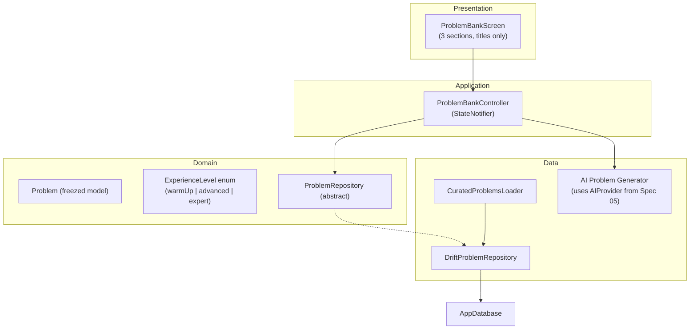

# Spec 02: Problem Bank — plan.md

## Architecture Overview

## Copywriting Specification

The three section headers and their subtitles must match exactly:

| Section Header | Subtitle | Maps from difficulty |
|----------------|----------|---------------------|
| **Warm-up Classics** | *Recommended first — build foundations with familiar systems* | easy |
| **Advanced Systems** | *For skilled developers — complex trade-offs and scaling* | medium |
| **Expert Challenges** | *For expert developers — ambiguous, cutting-edge problems* | hard |

Section ordering is fixed: Warm-up → Advanced → Expert.

## Design Philosophy: No Spoilers

The UI must never reveal **anything** about a problem beyond its title until the user starts the interview. This mirrors the real interview experience:
- No difficulty badges
- No category tags
- No topic lists
- No description preview
- No reference solutions until after evaluation

The metadata (difficulty, category, tags) exists only to:
1. Group problems into sections (via difficulty)
2. Feed the AI evaluator for targeted feedback (via category/tags)
3. Guide AI problem generation (via experience level)

## Technology Stack and Key Decisions

| Decision | Choice | Rationale |
|----------|--------|-----------|
| Problem storage | Drift (Problems table) | Relational queries, search via LIKE |
| Curated data format | JSON asset file | Easy to version, human-readable |
| Search | SQL LIKE on title only | Description is a spoiler — don't expose via search |
| Section grouping | Derived from difficulty field at query time | No extra column needed |
| AI generation | Depends on Spec 05 AI Provider | Experience-level-aware prompt |

## Implementation Sequence

1. Define `ExperienceLevel` enum and Problem domain model
2. Implement ProblemRepository port with section query methods
3. Create `curated_problems.json` with initial problem set (5-10 per section)
4. Implement DriftProblemRepository
5. Build CuratedProblemsLoader
6. Implement ProblemBankController with sectioned state
7. Build ProblemBankScreen with 3 sections, titles-only rendering
8. Wire AI problem generation (depends on Spec 05)

## Constitution Verification

- **TDD**: Every task in tasks.md has a "Write tests" step before implementation.
- **Clean architecture**: Domain model has zero data-layer imports; UI never touches Drift directly.
- **No spoilers principle**: UI widgets explicitly forbid rendering difficulty, category, tags, or description anywhere in Problem Bank screens.
- **Linter**: `flutter analyze` must pass with zero warnings.

## Assumptions and Open Questions

- **Assumption**: ~20-30 problems for V1 — aim for balanced distribution (~10 warm-up, ~10 advanced, ~5-10 expert).
- **Assumption**: Reference solutions are markdown strings, shown only in Evaluation Result screen.
- **Open**: Should we show an empty state when a section has no problems, or hide the section? Plan assumes show with placeholder message.
