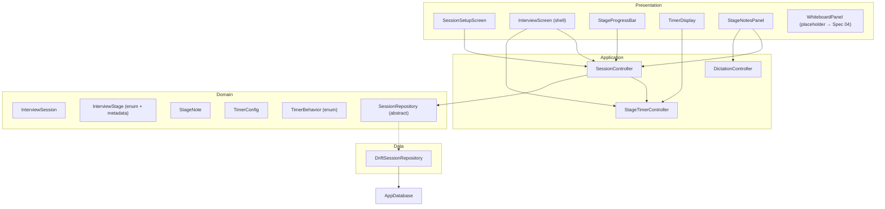
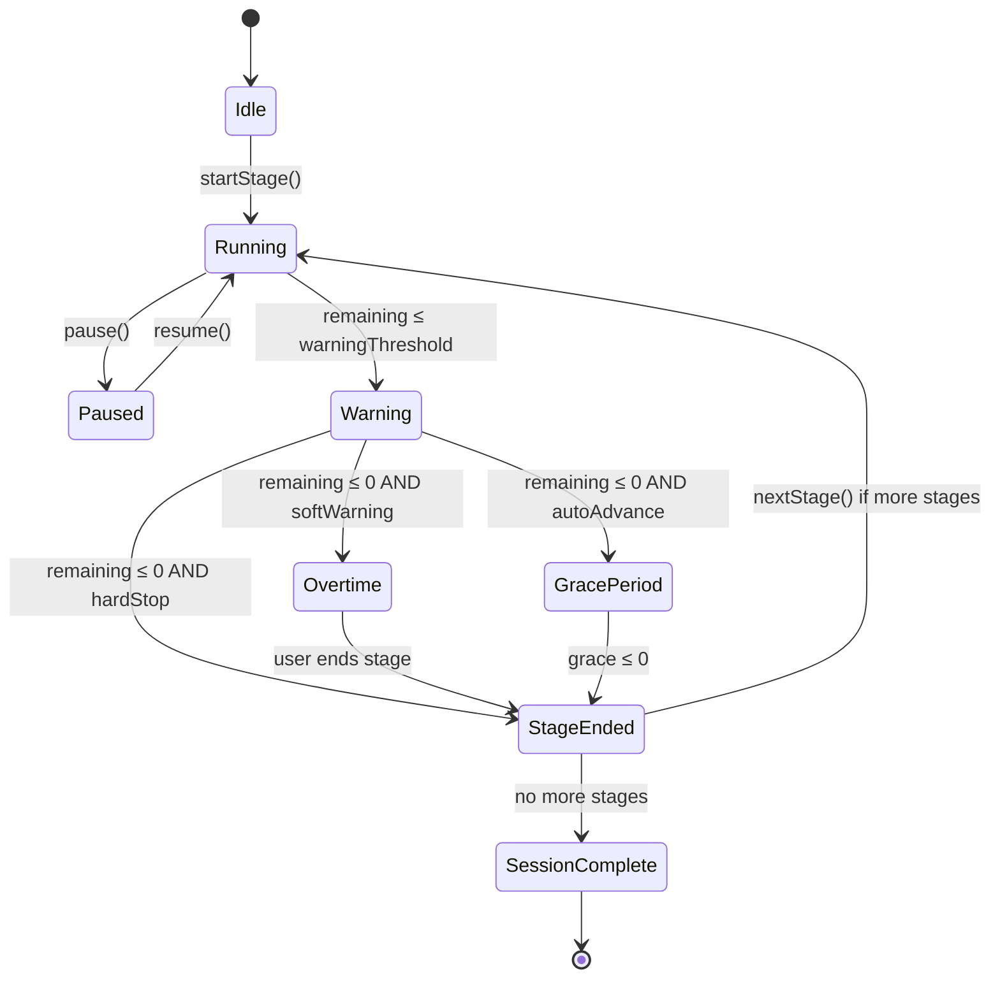

# Spec 03: Interview Session & Timer — plan.md

## Architecture Overview

## Timer State Machine

## Technology Stack and Key Decisions

| Decision | Choice | Rationale |
|----------|--------|-----------|
| Timer implementation | `dart:async` Timer.periodic (1s) | Simple, reliable for 1-second ticks |
| Notes debounce | Custom debounce in controller | Avoids extra dependency; 1s debounce on text changes |
| Split panel | Flutter's `ResizableWidget` or custom `GestureDetector` on divider | Desktop-appropriate resizable split view |
| Stage metadata | Hardcoded in `InterviewStage` enum extension | Data from CSV is static, no need for DB storage |
| Speech-to-text | `speech_to_text` Flutter package | Uses native macOS `SFSpeechRecognizer` — on-device, no network dependency, works regardless of WebView focus |

## Implementation Sequence

1. Define InterviewStage enum with ONLY display name and durations (no topic/technique metadata)
2. Define domain models (InterviewSession, StageNote, TimerConfig, TimerBehavior)
3. Implement StageTimerController (most complex — all 3 modes)
4. Implement SessionRepository port + Drift implementation
5. Implement SessionController
6. Build SessionSetupScreen
7. Build InterviewScreen workspace layout
8. Build TimerDisplay, StageProgressBar, StageNotesPanel
9. Build DictationController (manages SpeechToText lifecycle, appends results to notes)
10. Build dictation providers (Riverpod StateNotifier for DictationController)
11. Update StageNotesPanel with mic toggle button and dictation indicator
12. Add macOS microphone entitlement and Info.plist usage description
13. Stop dictation on session end/abandon in InterviewScreen

## Constitution Verification

- **TDD**: Every task has tests before implementation.
- **No-spoilers principle**: UI renders only problem statement + stage name + timer + notes + whiteboard. No reference data from CSV is shown during interview.
- **Clean architecture**: Timer logic is pure Dart with no UI dependencies → fully unit testable.
- **Separation of concerns**: Session state changes are funneled through SessionController → single source of truth. Whiteboard integration point is a placeholder widget → Spec 04 plugs in without changing session logic.
- **Dictation is a first-class input**: Dictated text is stored in `StageNote.notes` alongside typed text, with no separate field. The notes field is the canonical input for AI evaluation (Spec 06), regardless of whether the text was typed or dictated.

## Assumptions and Open Questions

- **Assumption**: Warning threshold defaults to 60 seconds before stage end (proportional for short stages).
- **Assumption**: Grace period for auto-advance is 30 seconds.
- **Open**: Should the notes panel support rich text (bold, headers, lists) or plain text? Plan assumes plain text with monospace option.
- **Resolved**: Dictation uses `speech_to_text` package with native macOS `SFSpeechRecognizer`. Unlike macOS system dictation (Fn-Fn), this works at the Flutter layer and does not depend on text field focus — so it continues working when the user interacts with the whiteboard WebView.
