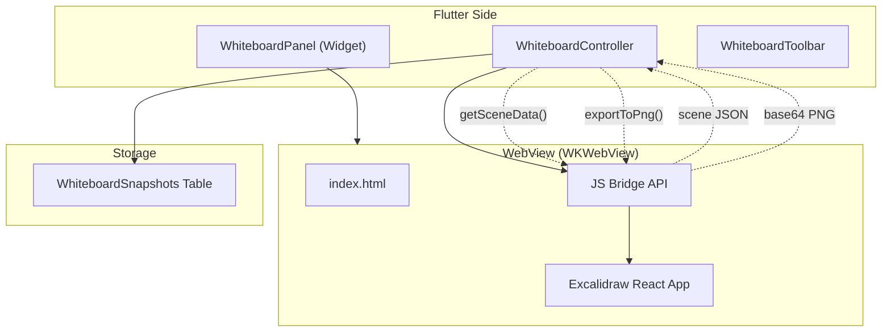
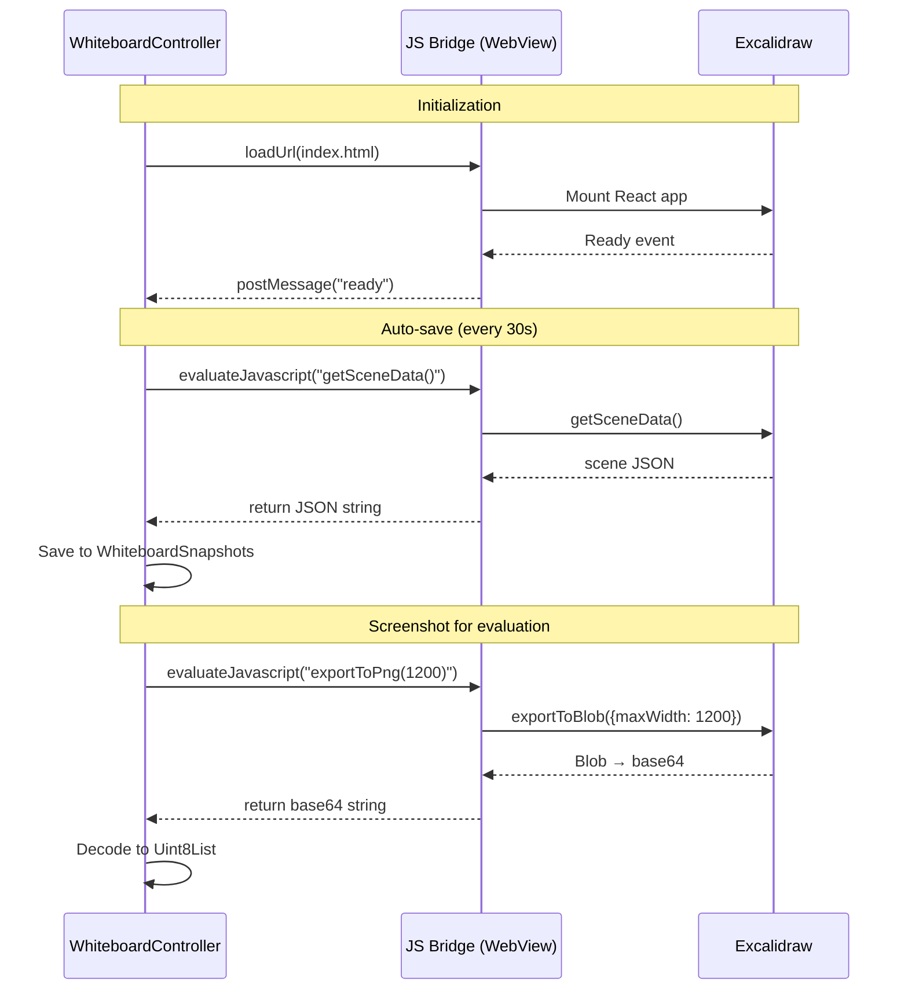

# Spec 04: Whiteboard Integration — plan.md

## Architecture Overview

## Communication Protocol

## Technology Stack and Key Decisions

| Decision | Choice | Rationale |
|----------|--------|-----------|
| WebView package | `webview_flutter` (WKWebView on macOS) | Official Flutter team; JS interop support |
| Excalidraw version | Bundled build (not CDN) | Offline support, version control, faster loads |
| Communication | JavaScript channels + evaluateJavascript | Standard WebView interop pattern |
| Fallback | `flutter_inappwebview` if needed | More mature macOS support if issues arise |

## Implementation Sequence

1. Build standalone Excalidraw HTML page with JS bridge API
2. Test HTML page in browser to verify API works
3. Create WhiteboardController with JS interop methods
4. Build WhiteboardPanel widget hosting the WebView
5. Integrate auto-save loop
6. Implement screenshot capture
7. Add WhiteboardToolbar (clear, export)
8. Integrate into InterviewScreen (replace placeholder from Spec 03)

## Constitution Verification

- Excalidraw assets are bundled, not fetched from network → works offline.
- WhiteboardController is the single bridge between Flutter and WebView → all JS calls go through it.
- If WebView package needs swapping, only `WhiteboardPanel` changes — controller interface stays the same.

## Assumptions and Open Questions

- **Assumption**: Excalidraw React app can be built into a single-page bundle for WebView embedding.
- **Assumption**: WKWebView on macOS supports Canvas API (needed for `exportToBlob`).
- **Open**: Should we preinstall Excalidraw libraries via npm build step, or use a prebuilt distribution? Plan assumes prebuilt.
- **RISK**: This is the highest-risk spec. Proof of concept (WebView + JS interop on macOS) should be validated before full implementation.
