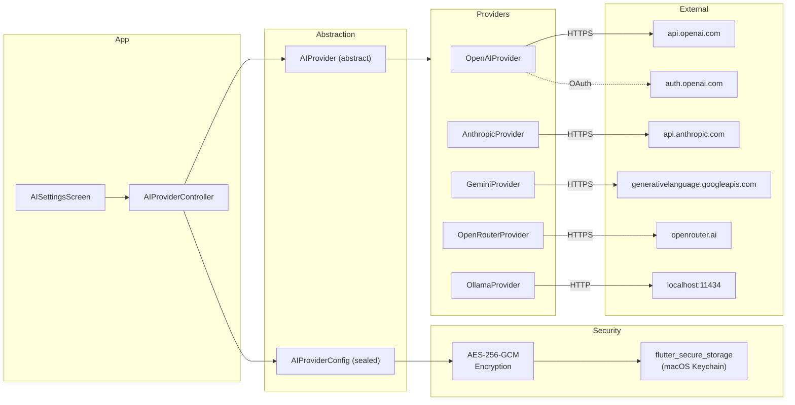

# Spec 05: AI Provider System — plan.md

## Architecture Overview

## Technology Stack and Key Decisions

| Decision | Choice | Rationale |
|----------|--------|-----------|
| HTTP client | dio | Interceptors for auth headers, retry, logging |
| Key storage | flutter_secure_storage → macOS Keychain | OS-level security for encryption key |
| Encryption | AES-256-GCM (pointycastle or encrypt package) | Industry standard symmetric encryption |
| OAuth | url_launcher + custom URI scheme handler | Standard desktop OAuth flow |
| Token refresh | Proactive via Timer check | Avoid expiry during evaluation |

## Implementation Sequence

1. Define AIProvider port and AIProviderConfig union
2. Implement key encryption service
3. Implement OpenAI provider (most common, test first)
4. Implement Anthropic provider
5. Implement Gemini provider
6. Implement OpenRouter provider
7. Implement Ollama provider
8. Implement AIProviderController
9. Build AI Settings screen
10. Implement OpenAI OAuth flow

## Constitution Verification

- Provider implementations are isolated — adding a new provider requires only: one new class implementing AIProvider, one new case in the settings UI.
- No API keys in source code or logs.
- All providers behind the same abstract port — evaluation and problem generation code never knows which provider is active.

## Assumptions and Open Questions

- **Assumption**: OpenAI OAuth client registration is available for desktop apps. If not, OAuth deferred to V1.1.
- **Assumption**: All listed providers support multimodal (text+image) input. Ollama depends on model.
- **Open**: Should we support multiple configured providers (switch between them) or only one at a time? Plan assumes multiple stored, one active.
- **Note**: Anthropic blocked third-party OAuth on April 4, 2026. API key only for Anthropic.
