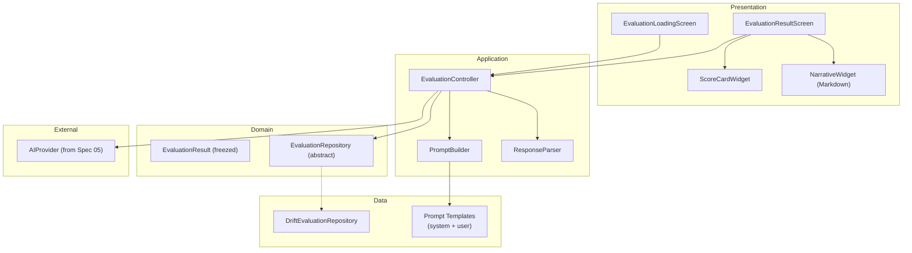
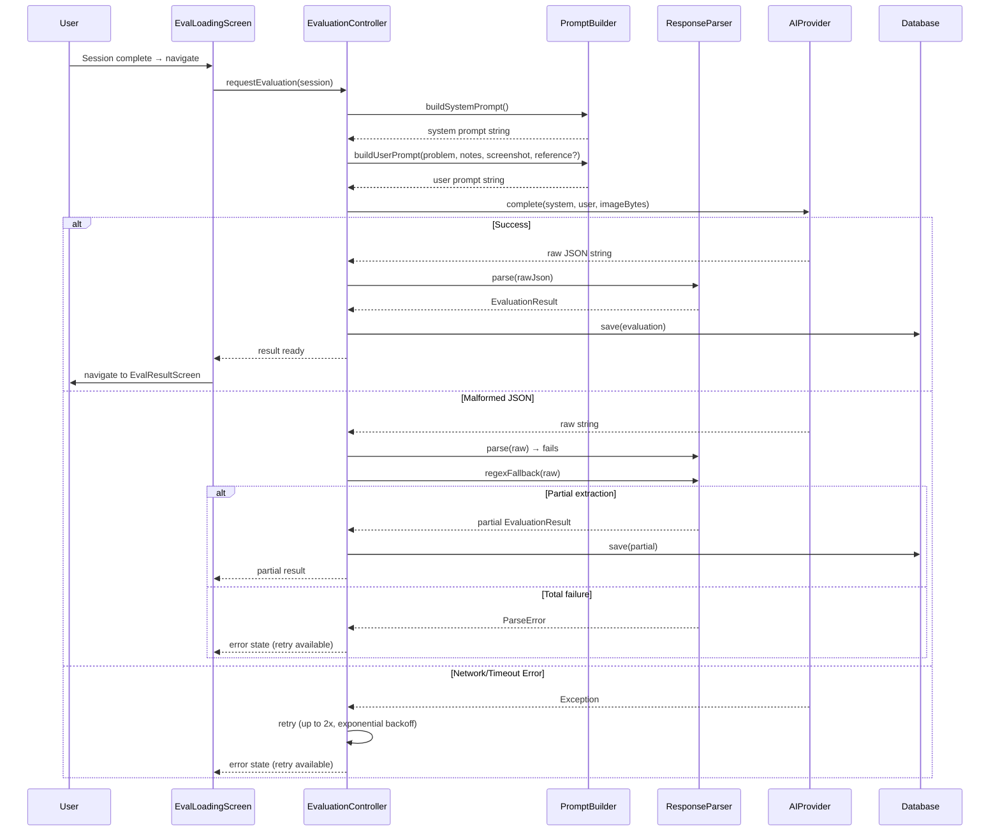

# Spec 06: AI Evaluation — plan.md

## Architecture Overview

## Evaluation Pipeline

## Technology Stack and Key Decisions

| Decision | Choice | Rationale |
|----------|--------|-----------|
| Markdown rendering | flutter_markdown | Standard, lightweight Markdown rendering |
| Score visualization | Custom painted bars | Simple colored bars, no charting library needed |
| Prompt templates | Dart string templates | Compile-time type safety, easy to test |
| JSON parsing | Manual with fallback regex | AI output is not guaranteed; need robustness |

## Implementation Sequence

1. Define EvaluationResult domain model
2. Build PromptBuilder (system + user prompt templates)
3. Build ResponseParser (JSON + regex fallback)
4. Implement EvaluationRepository + Drift implementation
5. Implement EvaluationController
6. Build ScoreCardWidget
7. Build EvaluationResultScreen
8. Build EvaluationLoadingScreen
9. Wire into SessionController (trigger on session end)

## Constitution Verification

- PromptBuilder has no AI provider dependency — it produces strings, not API calls.
- ResponseParser is pure Dart — fully testable with mock JSON/strings.
- EvaluationController orchestrates but delegates: prompt building, AI calling, response parsing, and storage are each separate concerns.

## Assumptions and Open Questions

- **Assumption**: All target AI models support structured JSON output (or can be prompted to).
- **Assumption**: Scorecard dimensions are fixed for V1 (7 dimensions).
- **Open**: Should we use JSON mode (where available, e.g., OpenAI `response_format: json_object`) or rely purely on prompt instruction? Plan assumes prompt instruction with JSON mode as enhancement.
- **Resolved**: Dictated text (from Spec 03 FR-03.9–FR-03.11) is stored in `StageNote.notes` alongside typed text. The evaluation pipeline reads `StageNote.notes` as-is — no distinction between typed and dictated content. No changes needed to `PromptBuilder` or `EvaluationController` beyond documenting this in FR-06.1.
