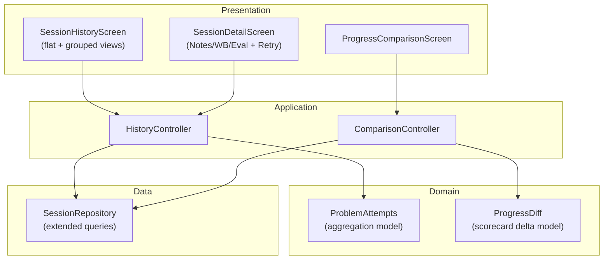

# Spec 07: Session History & Progress — plan.md

## Architecture Overview

Reuses existing domain models and repositories from Specs 02, 03, 04, 06. Adds:
- Aggregation query: sessions grouped by problem with attempt count + first/latest scores
- `ProblemAttempts` composite model (problem + list of attempts)
- `ProgressDiff` model (scorecard delta between two evaluations)
- Retry action: wires into `SessionController.startFullSession(problemId)` from Spec 03

## Technology Stack and Key Decisions

| Decision | Choice | Rationale |
|----------|--------|-----------|
| Aggregation | SQL GROUP BY in Drift query | Native SQL — fast for 100s of sessions |
| Comparison view | Side-by-side columns | Clear visual delta, no charting library needed |
| Trend indicators | Simple arrow + color | Minimal UI, at-a-glance signal |

## Implementation Sequence

1. Add aggregation queries to SessionRepository (grouped by problem)
2. Define `ProblemAttempts` and `ProgressDiff` domain models
3. Implement `HistoryController` with flat + grouped views
4. Implement `ComparisonController` (computes diff between two evaluations)
5. Build SessionHistoryScreen with view mode toggle
6. Build SessionDetailScreen (tabbed) with Retry + Compare buttons
7. Build ProgressComparisonScreen
8. Wire retry action into existing SessionController

## Constitution Verification

- **TDD**: Every task has tests written first.
- **Clean architecture**: Aggregation queries live in repository; controllers compose domain models; comparison logic is pure Dart.
- **No UI regressions**: Retry flow reuses existing Session Setup screen (Spec 03) — no duplication.
- **Linter**: All new files must pass `flutter analyze` with zero warnings.

## Assumptions and Open Questions

- **Assumption**: History is local only — no sync concerns for V1.
- **Assumption**: Comparison is between evaluations, not between notes (notes are free text, hard to diff meaningfully).
- **Open**: Should the comparison view show whiteboard diffs? Plan assumes whiteboards are viewable side-by-side but not diffed.
