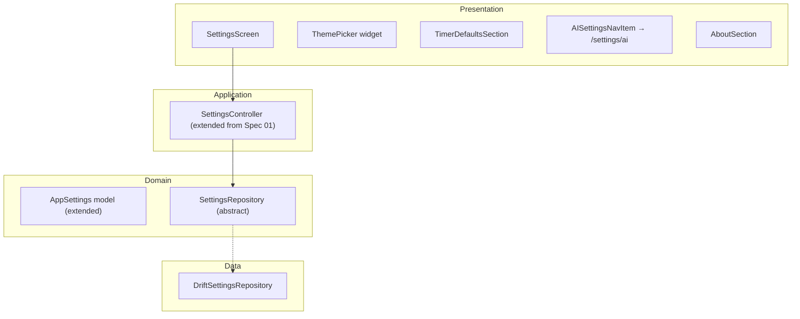

# Spec 08: App Settings — plan.md

## Architecture Overview

Extends existing Settings feature from Spec 01. No new architecture — just expanding the model and screen.

## Technology Stack and Key Decisions

| Decision | Choice | Rationale |
|----------|--------|-----------|
| Theme switching | MaterialApp + SettingsController | Real-time theme apply via Riverpod |
| Duration sliders | Flutter Slider widget | Bounded by InterviewStage min/max |
| Persistence | Drift AppSettings table | Already established in Spec 01 |

## Implementation Sequence

1. Extend AppSettings model with timer defaults
2. Update SettingsController
3. Build SettingsScreen UI
4. Wire navigation from Home

## Constitution Verification

- Extends Spec 01 architecture — no new layers or patterns introduced.
- Timer default values are bounded by `InterviewStage` min/max at the controller level — UI sliders cannot produce invalid values.

## Assumptions and Open Questions

- **Assumption**: Settings are simple key-value preferences, no complex logic.
- **Assumption**: "About" section reads version from `package_info_plus`.
